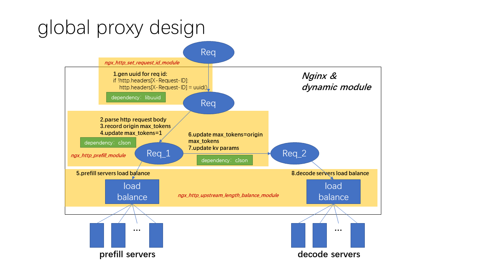

<h1 align="center">
Global Proxy
</h1>

## Global Proxy is A Nginx Enforced Proxy for P/D Disaggregation LLM Inference 

This guide describes how to build and configure the three dynamic modules, which are composed of Global Proxy for NGINX, 
* `ngx_http_upstream_length_balance_module`: enables request distribution based on request length to backend servers.
* `ngx_http_prefill_module`: implements prefill decode disaggregation logic. It first generates a subrequest to a internal uri `/prefill_internal` for prefill. After subrequest is done, the main request resumes to go to upstream servers for decode.
* `ngx_http_set_request_id_module`: inserts a `X-Request-Id` header if not exist.



---

## 1. Download Required Packages

Download the official NGINX source code and related packages:
```bash
wget --no-check-certificate https://nginx.org/download/nginx-1.28.0.tar.gz
tar -zxf nginx-1.28.0.tar.gz

yum install libuuid-devel

yum install cjson-devel

```
---
## 2. Build the Modules
```bash
cd nginx-1.28.0

# MUST ADD CFLAGS="-O2"!!!
CFLAGS="-O2" ./configure --with-compat --add-dynamic-module=/path/to/modules/ngx_http_prefill_module --add-dynamic-module=/path/to/modules/ngx_http_set_request_id_module --add-dynamic-module=/path/to/modules/ngx_http_upstream_length_balance_module

make -j16

make install

```
- `--add-dynamic-module` adds the modules.
- `--with-compat` ensures compatibility with the current NGINX version.
- `--with-debug` add to print debug logs.

## 3. Configure NGINX

Use the provided sample configuration to enable the module and configure upstream balancing.

1. **Edit the config file**  
   Copy or edit `nginx.conf` as follows (adjust paths as needed):

```nginx
load_module /usr/local/nginx/modules/ngx_http_set_request_id_module.so;
load_module /usr/local/nginx/modules/ngx_http_prefill_module.so;
load_module /usr/local/nginx/modules/ngx_http_upstream_length_balance_module.so;

error_log  /path/to/modules/error.log  debug;

events {
    worker_connections  1024;
}

http {
    client_body_buffer_size 512k;

    upstream prefill_servers {
	    length_balance;
        server 127.0.0.1:8090 max_fails=3 fail_timeout=10s;
        server 127.0.0.1:8091 max_fails=3 fail_timeout=10s;
        server 127.0.0.1:8092 max_fails=3 fail_timeout=10s;
        server 127.0.0.1:8093 max_fails=3 fail_timeout=10s;
    }

    upstream decode_servers {
	    length_balance;
        server 127.0.0.1:8094 max_fails=3 fail_timeout=10s;
        server 127.0.0.1:8095 max_fails=3 fail_timeout=10s;
        server 127.0.0.1:8096 max_fails=3 fail_timeout=10s;
        server 127.0.0.1:8097 max_fails=3 fail_timeout=10s;
    }

    log_format main '$remote_addr - $remote_user [$time_local] "$request" '
                    '$status $body_bytes_sent "$http_referer" '
                    '"$http_user_agent" "$http_x_forwarded_for" '
                    '"upstream: $upstream_addr" "request_length: $request_length"';

    server {
        listen 85;
        server_name localhost;

        location /v1/completions {
            prefill /prefill_internal;
            proxy_pass http://decode_servers;
            proxy_set_header Host $host;
            proxy_set_header X-Real-IP $remote_addr;
            proxy_set_header X-Forwarded-For $proxy_add_x_forwarded_for;
            proxy_set_header X-Forwarded-Proto $scheme;
        }

        location /prefill_internal {
            internal;
            rewrite /prefill_internal/(.*) /$1 break;
            proxy_pass http://prefill_servers;
            proxy_set_header Host $host;
            proxy_set_header X-Real-IP $remote_addr;
            proxy_set_header X-Forwarded-For $proxy_add_x_forwarded_for;
            proxy_set_header X-Forwarded-Proto $scheme;
        }

    }

}

```

**Key Points:**
- `load_module` loads the modules.
- `upstream backend` uses the `length_balance` directive to enable request length-based load balancing.
- Multiple backend servers are defined on different ports.
- Logging is configured to record request and upstream details for later analysis.
- The server listens on port **85**.

---

## 5. Run NGINX

### Start and Test NGINX

```bash
# Test nginx configuration (in the build directory)
objs/nginx -t

# Start nginx with the custom config
objs/nginx -c $(pwd)/modules/nginx.conf
```

### Stop NGINX

```bash
objs/nginx -c $(pwd)/modules/nginx.conf -s stop
```
